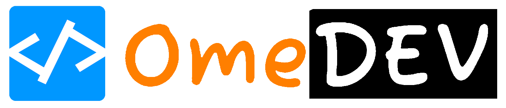
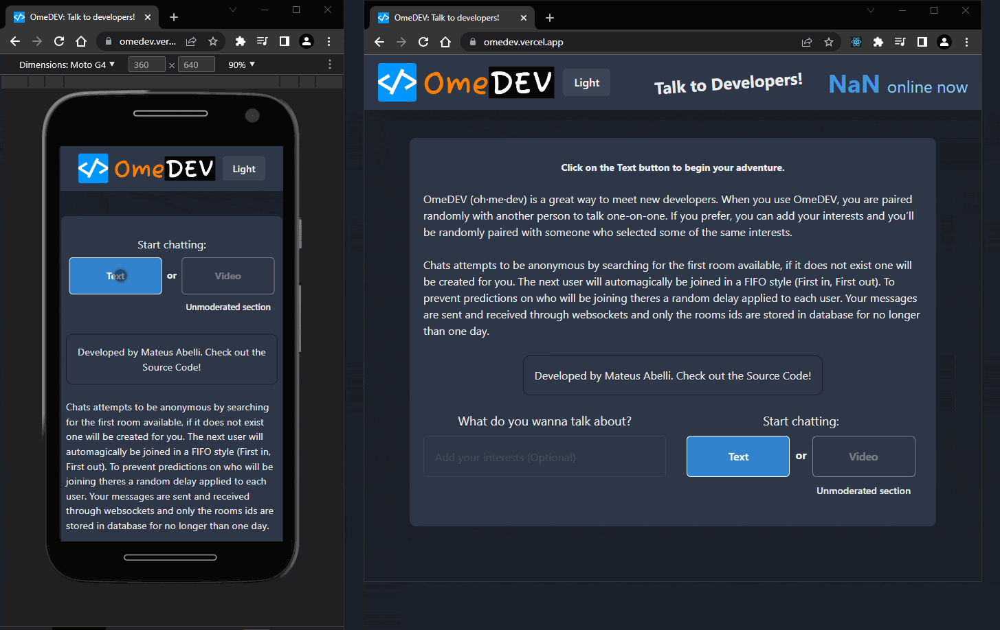
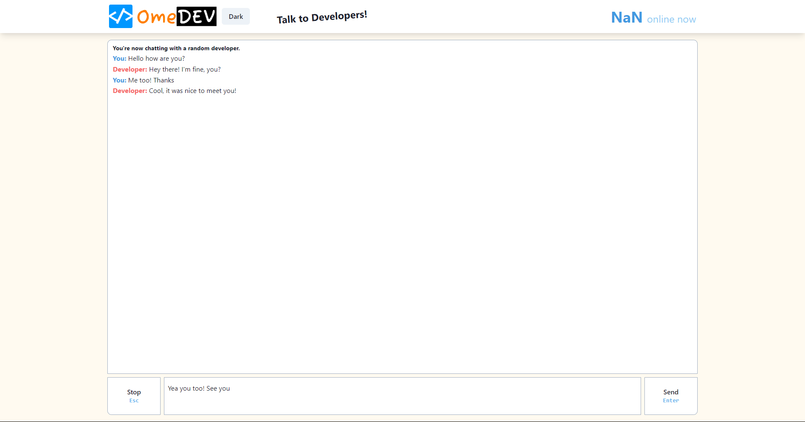
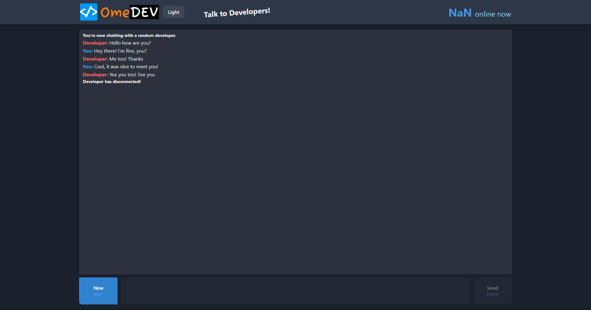

<p align="center">
    
</p>

<p align="center">
    <a href="https://github.com/mateusabelli/omedev/blob/main/LICENSE.md" alt="License">
      </a>
    <a href="https://github.com/mateusabelli/omedev/issues" alt="Issues">
      </a>
    <a href="https://github.com/mateusabelli/omedev/pulls" alt="Pull Requests">
      </a>
    <a href="https://github.com/mateusabelli/omedev/stargazers" alt="GitHub Stars">
      </a>
</p>

OmeDEV is an Omegle clone that lets you connect "randomly" with stranger developers to have a nice chat.

When you connect with someone, the chats attempts to be anonymous by searching for the first room available, if it does not exist one will be created for you. The next user will _automagically_ be joined in a FIFO style (First in, First out). To prevent predictions on who will be joining theres a random delay applied to each user. Your messages are sent and received through websocket and only the rooms ids are stored in database for no longer than one day.

> **Note**
> The code is not optimized nor compatible with the good practices. [Read more](#motivation)

## Table of Contents

- [Motivation](#motivation)
- [Usage](#usage)
  - [Demo](#demo)
  - [Light theme](#light-theme)
  - [Dark theme](#dark-theme)
- [Development](#development)
- [Tech Stack](#tech-stack)
- [How to Contribute](#how-to-contribute)
- [License](#license)

## Motivation

This project has been made to participate in the [DEV MongoDB Atlas Hackathon 2022](https://dev.to/devteam/announcing-the-mongodb-atlas-hackathon-2022-on-dev-2107), it is my first chat application and my first time using some of the tools that I've chosen on the [Tech Stack](#tech-stack).

I've learned a ton but the biggest lesson was to always try to organize the ideas and plan out before coding. This application was built while I was learning about how everything would work, so there was little to no planning in the project.

## Usage

To start chats you can simple click on the **Text** button and wait until someone connects with you.

You can send messages by pressing `Enter` or clicking on the **Send** button. You can leave a chat at anytime by closing the browser tab/window or pressing **Stop**, this will trigger an event notifying the other person that you've disconnected.

The app is fully responsive and it has auto scroll whenever new messages or events arrives, so it should be easy and fun to use in mobile devices.

### Demo

</a>

### Light theme



### Dark theme



## Development

Clone the repo and install the dependencies

```bash
$ git clone https://github.com/mateusabelli/omedev.git

$ cd omedev

$ npm install
```

Set up MongoDB and Pusher env variables

```bash
# .env.local
PUSHER_APP_ID=
PUSHER_KEY=
NEXT_PUBLIC_PUSHER_KEY= SAME AS PUSHER_KEY
PUSHER_SECRET=
PUSHER_CLUSTER=
NEXT_PUBLIC_PUSHER_CLUSTER= SAME AS PUSHER_CLUSTER
NEXT_PUBLIC_URL=http://localhost:3000
```

Next is the database URL for Prisma

```bash
# .env
DATABASE_URL=
```

With everything ready you can now run the app

```bash
npm run dev
```

## Tech Stack

This project was built using:

- NextJS
- Typescript
- Chakra UI
- Pusher Channels
- Axios
- Prisma
- MongoDB Atlas

## How to Contribute

All contributions are welcome and much appreciated!

- Take a look at the existing [Issues](https://github.com/mateusabelli/omedev/issues) or [create a new issue](https://github.com/mateusabelli/omedev/issues/new/)!
- [Fork the Repo](https://github.com/mateusabelli/omedev/fork). Then, create a branch for any issue that you are working on. Finally, commit your work.
- Create a **[Pull Request](https://github.com/mateusabelli/omedev/compare)** (_PR_), which will be promptly reviewed and given suggestions for improvements by the community.
- Add screenshots or screen captures to your Pull Request to help us understand the effects of the changes proposed in your PR.

> [Read more](https://github.com/mateusabelli/.github/blob/main/CONTRIBUTING.md)

## License

This project is under the MIT license, read the [LICENSE](./LICENSE.md) file for more details.
